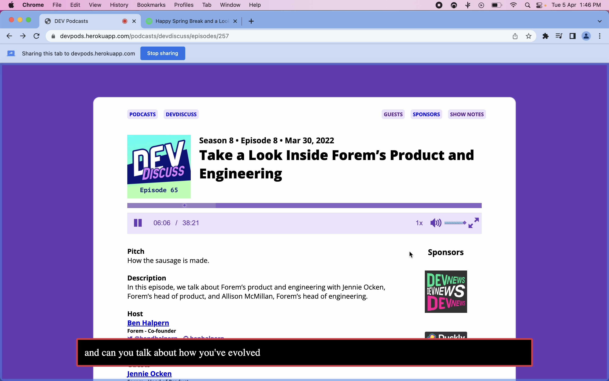

<div align="center">

# Captioner

 
 

Get subtiles/captions for any audio/video being played. Deepgram hackathon submission.

[Installation](#installation) •
[Usage](#usage) •
[Build From Source](#build-from-source) •
[Privacy](#privacy) •
[FAQs](#faqs)



</div>

## Installation
This extension is published on chrome web store.

[](https://chrome.google.com/webstore/detail/captioner/gjcdikfmiodlggkpnllcjbffjfbhfnnn)

## Usage

**This extension will require a Deepgram API key for transcription. Get it from [here](https://console.deepgram.com/signup)**

## Build from source:

```bash
git clone https://github.com/gajananpp/captioner.git

cd captioner

npm install

npm run build
```
This will output extension in dist folder which you can load in your browser by following this [steps](https://developer.chrome.com/docs/extensions/mv3/getstarted/#:~:text=The%20directory%20holding%20the%20manifest%20file%20can%20be%20added%20as%20an%20extension%20in%20developer%20mode%20in%20its%20current%20state.).


## Privacy
The only external api call this extension makes is to [`wss://api.deepgram.com/v1/listen`](https://developers.deepgram.com/api-reference/#transcription-streaming) passing it the audio blobs from selected audio source as payload.

## FAQs

**Q: With which browsers is this extension compatible ?**
<br>
This extension will work with chrome and other chromium based browsers like edge, brave etc. and can be tweaked to work with firefox and other browsers.

<br>

**Q: From where can this extension be installed ?**
<br>
This extension is published on chrome web store. Click below to view it in chrome web store.

[](https://chrome.google.com/webstore/detail/captioner/gjcdikfmiodlggkpnllcjbffjfbhfnnn)

<br>

**Q: Subtitles are slower than audio/video ?**
<br>
Adjusting the [`timeslice`](https://github.com/gajananpp/captioner/blob/main/src/content-script/index.tsx#L21) of `AudioRecorder` may reduce the lag between subtitles and audio/video.

<br>